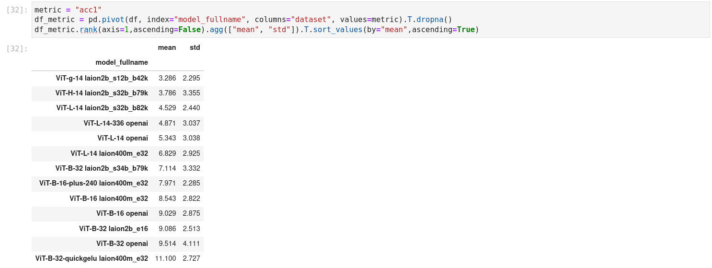

# InternVL for Zero-Shot Image Classification & Image-Text Retrieval

This folder contains the implementation of InternVL 1.0 for zero-shot image classification and zero-shot image-text retrieval, which corresponds to Section 4.3 of our [InternVL 1.0 paper](https://arxiv.org/pdf/2312.14238).
We mainly use [CLIP Benchmark](https://github.com/LAION-AI/CLIP_benchmark) to evaluate the performance of InternVL. Thanks for this great work.

## 🛠️ Installation

First, follow the [installation guide](../INSTALLATION.md) to perform some basic installations.

In addition, using this codebase requires executing the following steps:

- Install other requirements:

  ```bash
  pip install -r requirements.txt
  ```

- Install `clip_benchmark` using development mode:

  ```bash
  python setup.py develop
  # You can also add the current directory to PYTHONPATH instead.
  export PYTHONPATH="${PYTHONPATH}:$(pwd)"
  ```

## 📦 Data Preparation

This codebase will automatically download the required dataset. If the dataset fails to download automatically, please refer to this [code](./clip_benchmark/datasets/builder.py) for manual downloading.

## 📦 Model Preparation

| model name               |    type     | download                                                                                   |  size   |
| ------------------------ | :---------: | ------------------------------------------------------------------------------------------ | :-----: |
| internvl_c_13b_224px.pth |   pytorch   | 🤗 [HF link](https://huggingface.co/OpenGVLab/InternVL/blob/main/internvl_c_13b_224px.pth) | 25.4 GB |
| InternVL-14B-224px       | huggingface | 🤗 [HF link](https://huggingface.co/OpenGVLab/InternVL-14B-224px)                          | 27.7 GB |

Please download the above model weights and place them in the `pretrained/` folder.

You can download either the PyTorch version or the Hugging Face version based on your needs.

```sh
cd pretrained/
wget https://huggingface.co/OpenGVLab/InternVL/resolve/main/internvl_c_13b_224px.pth
# pip install -U huggingface_hub
huggingface-cli download --resume-download --local-dir-use-symlinks False OpenGVLab/InternVL-14B-224px --local-dir InternVL-14B-224px
```

The directory structure is:

```sh
pretrained
├── internvl_c_13b_224px.pth
└── InternVL-14B-224px/
```

## 📊 Evaluation: Zero-Shot Image Classification

### ImageNet variants and ObjectNet

| model name | IN-1K | IN-A | IN-R | IN-V2 | IN-Sketch | ObjectNet |  ∆  | average |
| :--------: | :---: | :--: | :--: | :---: | :-------: | :-------: | :-: | :-----: |
| InternVL-C | 83.2  | 83.8 | 95.5 | 77.3  |   73.9    |   80.6    | 0.8 |  82.4   |

<details>
  <summary>[InternVL-C] ImageNet-1K val</summary>

```bash
CUDA_VISIBLE_DEVICES=0 python3 clip_benchmark/cli.py eval --model_type internvl --language "en" \
    --task "zeroshot_classification" --dataset "imagenet1k" --dataset_root ./data/imagenet-1k/ \
    --model internvl_c_classification --pretrained ./pretrained/internvl_c_13b_224px.pth --output result.json
```

Expected results:

```
{"dataset": "imagenet1k", "model": "internvl_c_classification", "pretrained": "./pretrained/internvl_c_13b_224px.pth", "task": "zeroshot_classification",
"metrics": {"acc1": 0.83178, "acc5": 0.97322, "mean_per_class_recall": 0.83204}, "language": "en"}
```

</details>

<details>
  <summary>[InternVL-C] ImageNet-A</summary>

```bash
CUDA_VISIBLE_DEVICES=0 python3 clip_benchmark/cli.py eval --model_type internvl --language "en" \
    --task "zeroshot_classification" --dataset "imagenet-a" --dataset_root ./data/imagenet-a/ \
    --model internvl_c_classification --pretrained ./pretrained/internvl_c_13b_224px.pth --output result.json
```

Expected results:

```
{"dataset": "imagenet-a", "model": "internvl_c_classification", "pretrained": "./pretrained/internvl_c_13b_224px.pth", "task": "zeroshot_classification",
"metrics": {"acc1": 0.8377333333333333, "acc5": 0.9558666666666666, "mean_per_class_recall": 0.8183934468491632}, "language": "en"}
```

</details>

<details>
  <summary>[InternVL-C] ImageNet-R</summary>

```bash
CUDA_VISIBLE_DEVICES=0 python3 clip_benchmark/cli.py eval --model_type internvl --language "en" \
    --task "zeroshot_classification" --dataset "imagenet-r" --dataset_root ./data/imagenet-r/ \
    --model internvl_c_classification --pretrained ./pretrained/internvl_c_13b_224px.pth --output result.json
```

Expected results:

```
{"dataset": "imagenet-r", "model": "internvl_c_classification", "pretrained": "./pretrained/internvl_c_13b_224px.pth", "task": "zeroshot_classification",
"metrics": {"acc1": 0.9549666666666666, "acc5": 0.9918333333333333, "mean_per_class_recall": 0.9460205918105684}, "language": "en"}
```

</details>

<details>
  <summary>[InternVL-C] ImageNet-V2</summary>

```bash
CUDA_VISIBLE_DEVICES=0 python3 clip_benchmark/cli.py eval --model_type internvl --language "en" \
    --task "zeroshot_classification" --dataset "imagenetv2" --dataset_root ./data/imagenetv2/ \
    --model internvl_c_classification --pretrained ./pretrained/internvl_c_13b_224px.pth --output result.json
```

Expected results:

```
{"dataset": "imagenetv2", "model": "internvl_c_classification", "pretrained": "./pretrained/internvl_c_13b_224px.pth", "task": "zeroshot_classification",
"metrics": {"acc1": 0.7726, "acc5": 0.9468, "mean_per_class_recall": 0.7738000000000001}, "language": "en"}
```

</details>

<details>
  <summary>[InternVL-C] ImageNet-Sketch</summary>

```bash
CUDA_VISIBLE_DEVICES=0 python3 clip_benchmark/cli.py eval --model_type internvl --language "en" \
    --task "zeroshot_classification" --dataset "imagenet_sketch" --dataset_root ./data/imagenet-sketch/ \
    --model internvl_c_classification --pretrained ./pretrained/internvl_c_13b_224px.pth --output result.json
```

Expected results:

```
{"dataset": "imagenet_sketch", "model": "internvl_c_classification", "pretrained": "./pretrained/internvl_c_13b_224px.pth", "task": "zeroshot_classification",
"metrics": {"acc1": 0.7385879070133035, "acc5": 0.9199827074613374, "mean_per_class_recall": 0.7386403921568627}, "language": "en"}
```

</details>

<details>
  <summary>[InternVL-C] ObjectNet</summary>

```bash
CUDA_VISIBLE_DEVICES=0 python3 clip_benchmark/cli.py eval --model_type internvl --language "en" \
    --task "zeroshot_classification" --dataset "objectnet" --dataset_root ./data/objectnet-1.0/ \
    --model internvl_c_classification --pretrained ./pretrained/internvl_c_13b_224px.pth --output result.json
```

Expected results:

```
{"dataset": "objectnet", "model": "internvl_c_classification", "pretrained": "./pretrained/internvl_c_13b_224px.pth", "task": "zeroshot_classification",
"metrics": {"acc1": 0.8059114891784215, "acc5": 0.9387853989447615, "mean_per_class_recall": 0.797040815749882}, "language": "en"}
```

</details>

### Multilingual ImageNet-1K

| model name | IN-1K (EN) | IN-1K (ZH) | IN-1K (JP) | IN-1K (AR) | IN-1K (IT) | average |
| :--------: | :--------: | :--------: | :--------: | :--------: | :--------: | :-----: |
| InternVL-C |    83.2    |    64.5    |    61.5    |    44.9    |    65.7    |  64.0   |

<details>
  <summary>[InternVL-C] ImageNet-1K val (ZH, Chinese)</summary>

```bash
CUDA_VISIBLE_DEVICES=0 python3 clip_benchmark/cli.py eval --model_type internvl --language "cn" \
    --task "zeroshot_classification" --dataset "imagenet1k" --dataset_root ./data/imagenet-1k/ \
    --model internvl_c_classification --pretrained ./pretrained/internvl_c_13b_224px.pth --output result.json
```

Expected results:

```
{"dataset": "imagenet1k", "model": "internvl_c_classification", "pretrained": "./pretrained/internvl_c_13b_224px.pth", "task": "zeroshot_classification",
"metrics": {"acc1": 0.6446, "acc5": 0.87842, "mean_per_class_recall": 0.6444200000000001}, "language": "cn"}
```

</details>

<details>
  <summary>[InternVL-C] ImageNet-1K val (JP, Japanese)</summary>

```bash
CUDA_VISIBLE_DEVICES=0 python3 clip_benchmark/cli.py eval --model_type internvl --language "jp" \
    --task "zeroshot_classification" --dataset "imagenet1k" --dataset_root ./data/imagenet-1k/ \
    --model internvl_c_classification --pretrained ./pretrained/internvl_c_13b_224px.pth --output result.json
```

Expected results:

```
{"dataset": "imagenet1k", "model": "internvl_c_classification", "pretrained": "./pretrained/internvl_c_13b_224px.pth", "task": "zeroshot_classification",
"metrics": {"acc1": 0.61488, "acc5": 0.81146, "mean_per_class_recall": 0.6140599999999999}, "language": "jp"}
```

</details>

<details>
  <summary>[InternVL-C] ImageNet-1K val (AR, Arabic)</summary>

```bash
CUDA_VISIBLE_DEVICES=0 python3 clip_benchmark/cli.py eval --model_type internvl --language "ar" \
    --task "zeroshot_classification" --dataset "imagenet1k" --dataset_root ./data/imagenet-1k/ \
    --model internvl_c_classification --pretrained ./pretrained/internvl_c_13b_224px.pth --output result.json
```

Expected results:

```
{"dataset": "imagenet1k", "model": "internvl_c_classification", "pretrained": "./pretrained/internvl_c_13b_224px.pth", "task": "zeroshot_classification",
"metrics": {"acc1": 0.4486, "acc5": 0.66418, "mean_per_class_recall": 0.44764}, "language": "ar"}
```

</details>

<details>
  <summary>[InternVL-C] ImageNet-1K val (IT, Italian)</summary>

```bash
CUDA_VISIBLE_DEVICES=0 python3 clip_benchmark/cli.py eval --model_type internvl --language "it" \
    --task "zeroshot_classification" --dataset "imagenet1k" --dataset_root ./data/imagenet-1k/ \
    --model internvl_c_classification --pretrained ./pretrained/internvl_c_13b_224px.pth --output result.json
```

Expected results:

```
{"dataset": "imagenet1k", "model": "internvl_c_classification", "pretrained": "./pretrained/internvl_c_13b_224px.pth", "task": "zeroshot_classification",
"metrics": {"acc1": 0.65686, "acc5": 0.85254, "mean_per_class_recall": 0.6557799999999999}, "language": "it"}
```

</details>

### Other Datasets


<details>
  <summary>[InternVL-C] CIFAR-10</summary>

```bash
CUDA_VISIBLE_DEVICES=0 python3 clip_benchmark/cli.py eval --model_type internvl --language "en" --task "zeroshot_classification" \
    --dataset "cifar10" --dataset_root ./data/ --model internvl_c_classification \
    --pretrained ./pretrained/internvl_c_13b_224px.pth --output result.json
```

Expected results:

```
{"dataset": "cifar10", "model": "internvl_c_classification", "pretrained": "./pretrained/internvl_c_13b_224px.pth", "task": "zeroshot_classification",
"metrics": {"acc1": 0.9935, "acc5": 0.9996, "mean_per_class_recall": 0.9935}, "language": "en"}
```

</details>

<details>
  <summary>[InternVL-C] CIFAR-100</summary>

```bash
CUDA_VISIBLE_DEVICES=0 python3 clip_benchmark/cli.py eval --model_type internvl --language "en" --task "zeroshot_classification" \
    --dataset "cifar100" --dataset_root ./data/ --model internvl_c_classification \
    --pretrained ./pretrained/internvl_c_13b_224px.pth --output result.json
```

Expected results:

```
{"dataset": "cifar100", "model": "internvl_c_classification", "pretrained": "./pretrained/internvl_c_13b_224px.pth", "task": "zeroshot_classification",
"metrics": {"acc1": 0.9315, "acc5": 0.9925, "mean_per_class_recall": 0.9314}, "language": "en"}
```

</details>

<details>
  <summary>[InternVL-C] MNIST</summary>

```bash
CUDA_VISIBLE_DEVICES=0 python3 clip_benchmark/cli.py eval --model_type internvl --language "en" --task "zeroshot_classification" \
    --dataset "mnist" --dataset_root ./data/ --model internvl_c_classification \
    --pretrained ./pretrained/internvl_c_13b_224px.pth --output result.json
```

Expected results:

```
{"dataset": "mnist", "model": "internvl_c_classification", "pretrained": "./pretrained/internvl_c_13b_224px.pth", "task": "zeroshot_classification",
"metrics": {"acc1": 0.806, "acc5": 0.9743, "mean_per_class_recall": 0.8028667364603377}, "language": "en"}
```

</details>

<details>
  <summary>[InternVL-C] Caltech-101</summary>

```bash
CUDA_VISIBLE_DEVICES=0 python3 clip_benchmark/cli.py eval --model_type internvl --language "en" --task "zeroshot_classification" \
    --dataset "caltech101" --dataset_root ./data/ --model internvl_c_classification \
    --pretrained ./pretrained/internvl_c_13b_224px.pth --output result.json
```

Expected results:

```
{"dataset": "caltech101", "model": "internvl_c_classification", "pretrained": "./pretrained/internvl_c_13b_224px.pth", "task": "zeroshot_classification",
"metrics": {"acc1": 0.8949037620297463, "acc5": 0.9847987751531059, "mean_per_class_recall": 0.9548738053818752}, "language": "en"}
```

</details>

<details>
  <summary>[InternVL-C] SUN397</summary>

```bash
CUDA_VISIBLE_DEVICES=0 python3 clip_benchmark/cli.py eval --model_type internvl --language "en" --task "zeroshot_classification" \
    --dataset "sun397" --dataset_root ./data/ --model internvl_c_classification \
    --pretrained ./pretrained/internvl_c_13b_224px.pth --output result.json
```

Expected results:

```
{"dataset": "sun397", "model": "internvl_c_classification", "pretrained": "./pretrained/internvl_c_13b_224px.pth", "task": "zeroshot_classification",
"metrics": {"acc1": 0.7600180223256157, "acc5": 0.9623370174890119, "mean_per_class_recall": 0.7641970904214413}, "language": "en"}
```

</details>

<details>
  <summary>[InternVL-C] FGVC Aircraft</summary>

```bash
CUDA_VISIBLE_DEVICES=0 python3 clip_benchmark/cli.py eval --model_type internvl --language "en" --task "zeroshot_classification" \
    --dataset "fgvc_aircraft" --dataset_root ./data/ --model internvl_c_classification \
    --pretrained ./pretrained/internvl_c_13b_224px.pth --output result.json
```

Expected results:

```
{"dataset": "fgvc_aircraft", "model": "internvl_c_classification", "pretrained": "./pretrained/internvl_c_13b_224px.pth", "task": "zeroshot_classification",
"metrics": {"acc1": 0.5271527152715272, "acc5": 0.9426942694269427, "mean_per_class_recall": 0.5255169340463458}, "language": "en"}
```

</details>

<details>
  <summary>[InternVL-C] Country-211</summary>

```bash
CUDA_VISIBLE_DEVICES=0 python3 clip_benchmark/cli.py eval --model_type internvl --language "en" --task "zeroshot_classification" \
    --dataset "country211" --dataset_root ./data/ --model internvl_c_classification \
    --pretrained ./pretrained/internvl_c_13b_224px.pth --output result.json
```

Expected results:

```
{"dataset": "country211", "model": "internvl_c_classification", "pretrained": "./pretrained/internvl_c_13b_224px.pth", "task": "zeroshot_classification",
"metrics": {"acc1": 0.34080568720379145, "acc5": 0.6048815165876777, "mean_per_class_recall": 0.3406635071090047}, "language": "en"}
```

</details>

<details>
  <summary>[InternVL-C] Stanford Cars</summary>

```bash
CUDA_VISIBLE_DEVICES=0 python3 clip_benchmark/cli.py eval --model_type internvl --language "en" --task "zeroshot_classification" \
    --dataset "cars" --dataset_root ./data/ --model internvl_c_classification \
    --pretrained ./pretrained/internvl_c_13b_224px.pth --output result.json
```

Expected results:

```
{"dataset": "cars", "model": "internvl_c_classification", "pretrained": "./pretrained/internvl_c_13b_224px.pth", "task": "zeroshot_classification",
"metrics": {"acc1": 0.9416739211540853, "acc5": 0.99950254943415, "mean_per_class_recall": 0.9416684924576828}, "language": "en"}
```

</details>

<details>
  <summary>[InternVL-C] Birdsnap</summary>

```bash
CUDA_VISIBLE_DEVICES=0 python3 clip_benchmark/cli.py eval --model_type internvl --language "en" --task "zeroshot_classification" \
    --dataset "birdsnap" --dataset_root ./data/birdsnap/ --model internvl_c_classification \
    --pretrained ./pretrained/internvl_c_13b_224px.pth --output result.json
```

Expected results:

```
{"dataset": "birdsnap", "model": "internvl_c_classification", "pretrained": "./pretrained/internvl_c_13b_224px.pth", "task": "zeroshot_classification",
"metrics": {"acc1": 0.7203252032520325, "acc5": 0.9636856368563685, "mean_per_class_recall": 0.7027551020408164}, "language": "en"}
```

</details>

<details>
  <summary>[InternVL-C] DTD</summary>

```bash
CUDA_VISIBLE_DEVICES=0 python3 clip_benchmark/cli.py eval --model_type internvl --language "en" --task "zeroshot_classification" \
    --dataset "dtd" --dataset_root ./data/ --model internvl_c_classification \
    --pretrained ./pretrained/internvl_c_13b_224px.pth --output result.json
```

Expected results:

```
{"dataset": "dtd", "model": "internvl_c_classification", "pretrained": "./pretrained/internvl_c_13b_224px.pth", "task": "zeroshot_classification",
"metrics": {"acc1": 0.7074468085106383, "acc5": 0.9367021276595745, "mean_per_class_recall": 0.7079787234042553}, "language": "en"}
```

</details>

<details>
  <summary>[InternVL-C] Eurosat</summary>

```bash
CUDA_VISIBLE_DEVICES=0 python3 clip_benchmark/cli.py eval --model_type internvl --language "en" --task "zeroshot_classification" \
    --dataset "eurosat" --dataset_root ./data/ --model internvl_c_classification \
    --pretrained ./pretrained/internvl_c_13b_224px.pth --output result.json
```

Expected results:

```
{"dataset": "eurosat", "model": "internvl_c_classification", "pretrained": "./pretrained/internvl_c_13b_224px.pth", "task": "zeroshot_classification",
"metrics": {"acc1": 0.7937407407407407, "acc5": 0.9984074074074074, "mean_per_class_recall": 0.8013766666666665}, "language": "en"}
```

</details>

<details>
  <summary>[InternVL-C] FER2013</summary>

```bash
CUDA_VISIBLE_DEVICES=0 python3 clip_benchmark/cli.py eval --model_type internvl --language "en" --task "zeroshot_classification" \
    --dataset "fer2013" --dataset_root ./data/fer2013 --model internvl_c_classification \
    --pretrained ./pretrained/internvl_c_13b_224px.pth --output result.json
```

Expected results:

```
{"dataset": "fer2013", "model": "internvl_c_classification", "pretrained": "./pretrained/internvl_c_13b_224px.pth", "task": "zeroshot_classification",
"metrics": {"acc1": 0.561994984675397, "acc5": 0.9732516021175815, "mean_per_class_recall": 0.5305440899910082}, "language": "en"}
```

</details>

<details>
  <summary>[InternVL-C] Flowers-102</summary>

```bash
CUDA_VISIBLE_DEVICES=0 python3 clip_benchmark/cli.py eval --model_type internvl --language "en" --task "zeroshot_classification" \
    --dataset "vtab/flowers" --dataset_root ./data/ --model internvl_c_classification \
    --pretrained ./pretrained/internvl_c_13b_224px.pth --output result.json
```

Expected results:

```
{"dataset": "vtab/flowers", "model": "internvl_c_classification", "pretrained": "./pretrained/internvl_c_13b_224px.pth", "task": "zeroshot_classification",
"metrics": {"acc1": 0.8606277443486746, "acc5": 0.953651000162628, "mean_per_class_recall": 0.8563173902114554}, "language": "en"}
```

</details>

<details>
  <summary>[InternVL-C] Food-101</summary>

```bash
CUDA_VISIBLE_DEVICES=0 python3 clip_benchmark/cli.py eval --model_type internvl --language "en" --task "zeroshot_classification" \
    --dataset "food101" --dataset_root ./data/ --model internvl_c_classification \
    --pretrained ./pretrained/internvl_c_13b_224px.pth --output result.json
```

Expected results:

```
{"dataset": "food101", "model": "internvl_c_classification", "pretrained": "./pretrained/internvl_c_13b_224px.pth", "task": "zeroshot_classification",
"metrics": {"acc1": 0.9526336633663366, "acc5": 0.9954851485148515, "mean_per_class_recall": 0.9527524752475246}, "language": "en"}
```

</details>

<details>
  <summary>[InternVL-C] GTSRB</summary>

```bash
CUDA_VISIBLE_DEVICES=0 python3 clip_benchmark/cli.py eval --model_type internvl --language "en" --task "zeroshot_classification" \
    --dataset "gtsrb" --dataset_root ./data/ --model internvl_c_classification \
    --pretrained ./pretrained/internvl_c_13b_224px.pth --output result.json
```

Expected results:

```
{"dataset": "gtsrb", "model": "internvl_c_classification", "pretrained": "./pretrained/internvl_c_13b_224px.pth", "task": "zeroshot_classification",
"metrics": {"acc1": 0.6548693586698338, "acc5": 0.9089469517022961, "mean_per_class_recall": 0.5775180283147926}, "language": "en"}
```

</details>

<details>
  <summary>[InternVL-C] Pets</summary>

```bash
CUDA_VISIBLE_DEVICES=0 python3 clip_benchmark/cli.py eval --model_type internvl --language "en" --task "zeroshot_classification" \
    --dataset "pets" --dataset_root ./data/ --model internvl_c_classification \
    --pretrained ./pretrained/internvl_c_13b_224px.pth --output result.json
```

Expected results:

```
{"dataset": "pets", "model": "internvl_c_classification", "pretrained": "./pretrained/internvl_c_13b_224px.pth", "task": "zeroshot_classification",
"metrics": {"acc1": 0.9604796947397111, "acc5": 0.9991823385118561, "mean_per_class_recall": 0.9602545246926443}, "language": "en"}
```

</details>

<details>
  <summary>[InternVL-C] Rendered SST2</summary>

```bash
CUDA_VISIBLE_DEVICES=0 python3 clip_benchmark/cli.py eval --model_type internvl --language "en" --task "zeroshot_classification" \
    --dataset "renderedsst2" --dataset_root ./data/ --model internvl_c_classification \
    --pretrained ./pretrained/internvl_c_13b_224px.pth --output result.json
```

Expected results:

```
{"dataset": "renderedsst2", "model": "internvl_c_classification", "pretrained": "./pretrained/internvl_c_13b_224px.pth", "task": "zeroshot_classification",
"metrics": {"acc1": 0.6792970895112576, "acc5": NaN, "mean_per_class_recall": 0.6792944097041282}, "language": "en"}
```

</details>

<details>
  <summary>[InternVL-C] Resisc45</summary>

```bash
CUDA_VISIBLE_DEVICES=0 python3 clip_benchmark/cli.py eval --model_type internvl --language "en" --task "zeroshot_classification" \
    --dataset "vtab/resisc45" --dataset_root ./data/ --model internvl_c_classification \
    --pretrained ./pretrained/internvl_c_13b_224px.pth --output result.json
```

Expected results:

```
{"dataset": "vtab/resisc45", "model": "internvl_c_classification", "pretrained": "./pretrained/internvl_c_13b_224px.pth", "task": "zeroshot_classification",
"metrics": {"acc1": 0.7422631328360577, "acc5": 0.9663545468973179, "mean_per_class_recall": 0.7481098478511045}, "language": "en"}
```

</details>

<details>
  <summary>[InternVL-C] STL10</summary>

```bash
CUDA_VISIBLE_DEVICES=0 python3 clip_benchmark/cli.py eval --model_type internvl --language "en" --task "zeroshot_classification" \
    --dataset "stl10" --dataset_root ./data/ --model internvl_c_classification \
    --pretrained ./pretrained/internvl_c_13b_224px.pth --output result.json
```

Expected results:

```
{"dataset": "stl10", "model": "internvl_c_classification", "pretrained": "./pretrained/internvl_c_13b_224px.pth", "task": "zeroshot_classification",
"metrics": {"acc1": 0.9945, "acc5": 1.0, "mean_per_class_recall": 0.9945}, "language": "en"}
```

</details>

<details>
  <summary>[InternVL-C] VOC2007</summary>

```bash
CUDA_VISIBLE_DEVICES=0 python3 clip_benchmark/cli.py eval --model_type internvl --language "en" --task "zeroshot_classification" \
    --dataset "voc2007" --dataset_root ./data/ --model internvl_c_classification \
    --pretrained ./pretrained/internvl_c_13b_224px.pth --output result.json
```

Expected results:

```
{"dataset": "voc2007", "model": "internvl_c_classification", "pretrained": "./pretrained/internvl_c_13b_224px.pth", "task": "zeroshot_classification",
"metrics": {"acc1": 0.7997462606837606, "acc5": 0.9795005341880342, "mean_per_class_recall": 0.9048832641726575}, "language": "en"}
```

</details>

## 📊 Evaluation: Zero-Shot Image-Text Retrieval

### Flickr30K & COCO

<table>
  <tr align=center>
      <td rowspan="3" align=center><b>model</b></td>
      <td colspan="6" align=center><b>Flickr30K</b></td>
      <td colspan="6" align=center><b>COCO</b></td>
      <td rowspan="3" align=center><b>avg</b></td>

</tr>
   <tr align=center>
      <td colspan="3" align=center><b>image-to-text</b></td>
      <td colspan="3" align=center><b>text-to-image</b></td>
       <td colspan="3" align=center><b>image-to-text</b></td>
      <td colspan="3" align=center><b>text-to-image</b></td>
   </tr>
   <tr>
      <td>R@1</td>
      <td>R@5</td>
      <td>R@10</td>
      <td>R@1</td>
      <td>R@5</td>
      <td>R@10</td>
      <td>R@1</td>
      <td>R@5</td>
      <td>R@10</td>
      <td>R@1</td>
      <td>R@5</td>
      <td>R@10</td>
   </tr>

<tr align=center>
      <td>InternVL-C</td>
      <td>94.7</td>
      <td>99.6</td>
      <td>99.9</td>
      <td>81.7</td>
      <td>96.0</td>
      <td>98.2</td>
      <td>70.6</td>
      <td>89.0</td>
      <td>93.5</td>
      <td>54.1</td>
      <td>77.3</td>
      <td>84.6</td>
      <td>86.6</td>
   </tr>
<tr align=center>
      <td>InternVL-G</td>
      <td>95.7</td>
      <td>99.7</td>
      <td>99.9</td>
      <td>85.0</td>
      <td>97.0</td>
      <td>98.6</td>
      <td>74.9</td>
      <td>91.3</td>
      <td>95.2</td>
      <td>58.6</td>
      <td>81.3</td>
      <td>88.0</td>
      <td>88.8</td>
   </tr>

</table>

<details>
  <summary>[InternVL-C] Flickr30K</summary>

```bash
CUDA_VISIBLE_DEVICES=0 python3 clip_benchmark/cli.py eval --model_type internvl --language "en" --task "zeroshot_retrieval" \
    --dataset "flickr30k" --dataset_root ./data/flickr30k --model internvl_c_retrieval \
    --pretrained ./pretrained/internvl_c_13b_224px.pth --output result.json
```

Expected results:

```
{"dataset": "flickr30k", "model": "internvl_c_retrieval", "pretrained": "./pretrained/internvl_c_13b_224px.pth", "task": "zeroshot_retrieval",
"metrics": {"image_retrieval_recall@1": 0.8166000247001648, "text_retrieval_recall@1": 0.9470000267028809,
"image_retrieval_recall@5": 0.9603999853134155, "text_retrieval_recall@5": 0.9959999918937683,
"image_retrieval_recall@10": 0.9819999933242798, "text_retrieval_recall@10": 0.9990000128746033}, "language": "en"}
```

</details>

<details>
  <summary>[InternVL-C] COCO</summary>

```bash
CUDA_VISIBLE_DEVICES=0 python3 clip_benchmark/cli.py eval --model_type internvl --language "en" --task "zeroshot_retrieval" \
    --dataset "mscoco_captions" --dataset_root ./data/mscoco_captions --model internvl_c_retrieval \
    --pretrained ./pretrained/internvl_c_13b_224px.pth --output result.json
```

Expected results:

```
{"dataset": "mscoco_captions", "model": "internvl_c_retrieval", "pretrained": "./pretrained/internvl_c_13b_224px.pth", "task": "zeroshot_retrieval",
"metrics": {"image_retrieval_recall@1": 0.5411835312843323, "text_retrieval_recall@1": 0.7059999704360962,
"image_retrieval_recall@5": 0.7731707096099854, "text_retrieval_recall@5": 0.8902000188827515,
"image_retrieval_recall@10": 0.8463414907455444, "text_retrieval_recall@10": 0.9354000091552734}, "language": "en"}
```

</details>

<details>
  <summary>[InternVL-G] Flickr30K</summary>

```bash
CUDA_VISIBLE_DEVICES=0 python3 clip_benchmark/cli.py eval --model_type internvl --language "en" --task "zeroshot_retrieval" \
    --dataset "flickr30k" --dataset_root ./data/flickr30k --model internvl_g_retrieval_hf \
    --pretrained ./pretrained/InternVL-14B-224px --output result_g.json
```

Expected results:

```
{"dataset": "flickr30k", "model": "internvl_g_retrieval_hf", "pretrained": "./pretrained/InternVL-14B-224px", "task": "zeroshot_retrieval",
"metrics": {"image_retrieval_recall@1": 0.8497999906539917, "text_retrieval_recall@1": 0.9570000171661377,
"image_retrieval_recall@5": 0.9700000286102295, "text_retrieval_recall@5": 0.996999979019165,
"image_retrieval_recall@10": 0.98580002784729, "text_retrieval_recall@10": 0.9990000128746033}, "language": "en"}
```

</details>

<details>
  <summary>[InternVL-G] COCO</summary>

```bash
CUDA_VISIBLE_DEVICES=0 python3 clip_benchmark/cli.py eval --model_type internvl --language "en" --task "zeroshot_retrieval" \
    --dataset "mscoco_captions" --dataset_root ./data/mscoco_captions --model internvl_g_retrieval_hf \
    --pretrained ./pretrained/InternVL-14B-224px --output result_g.json
```

Expected results:

```
{"dataset": "mscoco_captions", "model": "internvl_g_retrieval_hf", "pretrained": "./pretrained/InternVL-14B-224px", "task": "zeroshot_retrieval",
"metrics": {"image_retrieval_recall@1": 0.5858056545257568, "text_retrieval_recall@1": 0.7491999864578247,
"image_retrieval_recall@5": 0.813194751739502, "text_retrieval_recall@5": 0.9129999876022339,
"image_retrieval_recall@10": 0.8795281648635864, "text_retrieval_recall@10": 0.9521999955177307}, "language": "en"}
```

</details>

### Flickr30K-CN & COCO-CN

<table>
  <tr align=center>
      <td rowspan="3" align=center><b>model</b></td>
      <td colspan="6" align=center><b>Flickr30K-CN</b></td>
      <td colspan="6" align=center><b>COCO-CN</b></td>
      <td rowspan="3" align=center><b>avg</b></td>

</tr>
   <tr align=center>
      <td colspan="3" align=center><b>image-to-text</b></td>
      <td colspan="3" align=center><b>text-to-image</b></td>
       <td colspan="3" align=center><b>image-to-text</b></td>
      <td colspan="3" align=center><b>text-to-image</b></td>
   </tr>
   <tr>
      <td>R@1</td>
      <td>R@5</td>
      <td>R@10</td>
      <td>R@1</td>
      <td>R@5</td>
      <td>R@10</td>
      <td>R@1</td>
      <td>R@5</td>
      <td>R@10</td>
      <td>R@1</td>
      <td>R@5</td>
      <td>R@10</td>
   </tr>

<tr align=center>
      <td>InternVL-C</td>
      <td>90.3</td>
      <td>98.8</td>
      <td>99.7</td>
      <td>75.1</td>
      <td>92.9</td>
      <td>96.4</td>
      <td>68.8</td>
      <td>92.0</td>
      <td>96.7</td>
      <td>68.9</td>
      <td>91.9</td>
      <td>96.5</td>
      <td>89.0</td>
   </tr>
<tr align=center>
      <td>InternVL-G</td>
      <td>92.9</td>
      <td>99.4</td>
      <td>99.8</td>
      <td>77.7</td>
      <td>94.8</td>
      <td>97.3</td>
      <td>71.4</td>
      <td>93.9</td>
      <td>97.7</td>
      <td>73.8</td>
      <td>94.4</td>
      <td>98.1</td>
      <td>90.9</td>
   </tr>

</table>

<details>
  <summary>[InternVL-C] Flickr30K-CN</summary>

```bash
CUDA_VISIBLE_DEVICES=0 python3 clip_benchmark/cli.py eval --model_type internvl --language "cn" --task "zeroshot_retrieval" \
    --dataset "flickr30k" --dataset_root ./data/flickr30k --model internvl_c_retrieval \
    --pretrained ./pretrained/internvl_c_13b_224px.pth --output result.json
```

Expected results:

```
{"dataset": "flickr30k", "model": "internvl_c_retrieval", "pretrained": "./pretrained/internvl_c_13b_224px.pth", "task": "zeroshot_retrieval",
"metrics": {"image_retrieval_recall@1": 0.7509999871253967, "text_retrieval_recall@1": 0.902999997138977,
"image_retrieval_recall@5": 0.9290000200271606, "text_retrieval_recall@5": 0.9879999756813049,
"image_retrieval_recall@10": 0.9638000130653381, "text_retrieval_recall@10": 0.996999979019165}, "language": "cn"}
```

</details>

<details>
  <summary>[InternVL-C] COCO-CN</summary>

```bash
CUDA_VISIBLE_DEVICES=0 python3 clip_benchmark/cli.py eval --model_type internvl --language "cn" --task "zeroshot_retrieval" \
    --dataset "mscoco_captions" --dataset_root ./data/mscoco_captions --model internvl_c_retrieval \
    --pretrained ./pretrained/internvl_c_13b_224px.pth --output result.json
```

Expected results:

```
{"dataset": "mscoco_captions", "model": "internvl_c_retrieval", "pretrained": "./pretrained/internvl_c_13b_224px.pth", "task": "zeroshot_retrieval",
"metrics": {"image_retrieval_recall@1": 0.6885090470314026, "text_retrieval_recall@1": 0.6880000233650208,
"image_retrieval_recall@5": 0.9192782640457153, "text_retrieval_recall@5": 0.9200000166893005,
"image_retrieval_recall@10": 0.9648622870445251, "text_retrieval_recall@10": 0.9670000076293945}, "language": "cn"}
```

</details>

<details>
  <summary>[InternVL-G] Flickr30K-CN</summary>

```bash
CUDA_VISIBLE_DEVICES=0 python3 clip_benchmark/cli.py eval --model_type internvl --language "cn" --task "zeroshot_retrieval" \
    --dataset "flickr30k" --dataset_root ./data/flickr30k --model internvl_g_retrieval_hf \
    --pretrained ./pretrained/InternVL-14B-224px --output result_g.json
```

Expected results:

```
{"dataset": "flickr30k", "model": "internvl_g_retrieval_hf", "pretrained": "./pretrained/InternVL-14B-224px", "task": "zeroshot_retrieval",
"metrics": {"image_retrieval_recall@1": 0.7767999768257141, "text_retrieval_recall@1": 0.9290000200271606,
"image_retrieval_recall@5": 0.9476000070571899, "text_retrieval_recall@5": 0.9940000176429749,
"image_retrieval_recall@10": 0.9728000164031982, "text_retrieval_recall@10": 0.9980000257492065}, "language": "cn"}

```

</details>

<details>
  <summary>[InternVL-G] COCO-CN</summary>

```bash
CUDA_VISIBLE_DEVICES=0 python3 clip_benchmark/cli.py eval --model_type internvl --language "cn" --task "zeroshot_retrieval" \
    --dataset "mscoco_captions" --dataset_root ./data/mscoco_captions --model internvl_g_retrieval_hf \
    --pretrained ./pretrained/InternVL-14B-224px --output result_g.json
```

Expected results:

```
{"dataset": "mscoco_captions", "model": "internvl_g_retrieval_hf", "pretrained": "./pretrained/InternVL-14B-224px", "task": "zeroshot_retrieval",
"metrics": {"image_retrieval_recall@1": 0.7378917336463928, "text_retrieval_recall@1": 0.7139999866485596,
"image_retrieval_recall@5": 0.9439696073532104, "text_retrieval_recall@5": 0.9390000104904175,
"image_retrieval_recall@10": 0.9810066223144531, "text_retrieval_recall@10": 0.9769999980926514}, "language": "cn"}
```

</details>

### XTD

| model name |  EN  |  ES  |  FR  |  ZH  |  IT  |  KO  |  RU  |  JP  | average |
| :--------: | :--: | :--: | :--: | :--: | :--: | :--: | :--: | :--: | :-----: |
| InternVL-C | 97.3 | 95.7 | 95.1 | 95.6 | 96.0 | 92.2 | 93.3 | 95.5 |  95.1   |
| InternVL-G | 98.6 | 97.7 | 96.5 | 96.7 | 96.9 | 95.1 | 94.8 | 96.1 |  96.6   |

<details>
  <summary>[InternVL-C] XTD</summary>

```bash
CUDA_VISIBLE_DEVICES=0 python3 clip_benchmark/cli.py eval --model_type internvl --task "zeroshot_retrieval" \
    --dataset "multilingual_mscoco_captions" --dataset_root ./data/mscoco_captions --model internvl_c_retrieval \
    --pretrained ./pretrained/internvl_c_13b_224px.pth --output result.json --language=en

CUDA_VISIBLE_DEVICES=0 python3 clip_benchmark/cli.py eval --model_type internvl --task "zeroshot_retrieval" \
    --dataset "multilingual_mscoco_captions" --dataset_root ./data/mscoco_captions --model internvl_c_retrieval \
    --pretrained ./pretrained/internvl_c_13b_224px.pth --output result.json --language=es

CUDA_VISIBLE_DEVICES=0 python3 clip_benchmark/cli.py eval --model_type internvl --task "zeroshot_retrieval" \
    --dataset "multilingual_mscoco_captions" --dataset_root ./data/mscoco_captions --model internvl_c_retrieval \
    --pretrained ./pretrained/internvl_c_13b_224px.pth --output result.json --language=fr

CUDA_VISIBLE_DEVICES=0 python3 clip_benchmark/cli.py eval --model_type internvl --task "zeroshot_retrieval" \
    --dataset "multilingual_mscoco_captions" --dataset_root ./data/mscoco_captions --model internvl_c_retrieval \
    --pretrained ./pretrained/internvl_c_13b_224px.pth --output result.json --language=zh

CUDA_VISIBLE_DEVICES=0 python3 clip_benchmark/cli.py eval --model_type internvl --task "zeroshot_retrieval" \
    --dataset "multilingual_mscoco_captions" --dataset_root ./data/mscoco_captions --model internvl_c_retrieval \
    --pretrained ./pretrained/internvl_c_13b_224px.pth --output result.json --language=it

CUDA_VISIBLE_DEVICES=0 python3 clip_benchmark/cli.py eval --model_type internvl --task "zeroshot_retrieval" \
    --dataset "multilingual_mscoco_captions" --dataset_root ./data/mscoco_captions --model internvl_c_retrieval \
    --pretrained ./pretrained/internvl_c_13b_224px.pth --output result.json --language=ko

CUDA_VISIBLE_DEVICES=0 python3 clip_benchmark/cli.py eval --model_type internvl --task "zeroshot_retrieval" \
    --dataset "multilingual_mscoco_captions" --dataset_root ./data/mscoco_captions --model internvl_c_retrieval \
    --pretrained ./pretrained/internvl_c_13b_224px.pth --output result.json --language=ru

CUDA_VISIBLE_DEVICES=0 python3 clip_benchmark/cli.py eval --model_type internvl --task "zeroshot_retrieval" \
    --dataset "multilingual_mscoco_captions" --dataset_root ./data/mscoco_captions --model internvl_c_retrieval \
    --pretrained ./pretrained/internvl_c_13b_224px.pth --output result.json --language=jp
```

Expected results:

```
{"dataset": "multilingual_mscoco_captions", "model": "internvl_c_retrieval", "pretrained": "./pretrained/internvl_c_13b_224px.pth", "task": "zeroshot_retrieval", "metrics": {"image_retrieval_recall@1": 0.7670000195503235, "text_retrieval_recall@1": 0.7480000257492065, "image_retrieval_recall@5": 0.9200000166893005, "text_retrieval_recall@5": 0.921999990940094, "image_retrieval_recall@10": 0.9670000076293945, "text_retrieval_recall@10": 0.9729999899864197}, "language": "en"}
{"dataset": "multilingual_mscoco_captions", "model": "internvl_c_retrieval", "pretrained": "./pretrained/internvl_c_13b_224px.pth", "task": "zeroshot_retrieval", "metrics": {"image_retrieval_recall@1": 0.7059999704360962, "text_retrieval_recall@1": 0.7009999752044678, "image_retrieval_recall@5": 0.9020000100135803, "text_retrieval_recall@5": 0.8960000276565552, "image_retrieval_recall@10": 0.9430000185966492, "text_retrieval_recall@10": 0.9570000171661377}, "language": "es"}
{"dataset": "multilingual_mscoco_captions", "model": "internvl_c_retrieval", "pretrained": "./pretrained/internvl_c_13b_224px.pth", "task": "zeroshot_retrieval", "metrics": {"image_retrieval_recall@1": 0.6970000267028809, "text_retrieval_recall@1": 0.6899999976158142, "image_retrieval_recall@5": 0.8830000162124634, "text_retrieval_recall@5": 0.8889999985694885, "image_retrieval_recall@10": 0.9350000023841858, "text_retrieval_recall@10": 0.9509999752044678}, "language": "fr"}
{"dataset": "multilingual_mscoco_captions", "model": "internvl_c_retrieval", "pretrained": "./pretrained/internvl_c_13b_224px.pth", "task": "zeroshot_retrieval", "metrics": {"image_retrieval_recall@1": 0.6480000019073486, "text_retrieval_recall@1": 0.6710000038146973, "image_retrieval_recall@5": 0.8759999871253967, "text_retrieval_recall@5": 0.8769999742507935, "image_retrieval_recall@10": 0.9419999718666077, "text_retrieval_recall@10": 0.9559999704360962}, "language": "zh"}
{"dataset": "multilingual_mscoco_captions", "model": "internvl_c_retrieval", "pretrained": "./pretrained/internvl_c_13b_224px.pth", "task": "zeroshot_retrieval", "metrics": {"image_retrieval_recall@1": 0.6790000200271606, "text_retrieval_recall@1": 0.7039999961853027, "image_retrieval_recall@5": 0.8989999890327454, "text_retrieval_recall@5": 0.8999999761581421, "image_retrieval_recall@10": 0.9440000057220459, "text_retrieval_recall@10": 0.9599999785423279}, "language": "it"}
{"dataset": "multilingual_mscoco_captions", "model": "internvl_c_retrieval", "pretrained": "./pretrained/internvl_c_13b_224px.pth", "task": "zeroshot_retrieval", "metrics": {"image_retrieval_recall@1": 0.5830000042915344, "text_retrieval_recall@1": 0.5920000076293945, "image_retrieval_recall@5": 0.8399999737739563, "text_retrieval_recall@5": 0.8360000252723694, "image_retrieval_recall@10": 0.9079999923706055, "text_retrieval_recall@10": 0.921999990940094}, "language": "ko"}
{"dataset": "multilingual_mscoco_captions", "model": "internvl_c_retrieval", "pretrained": "./pretrained/internvl_c_13b_224px.pth", "task": "zeroshot_retrieval", "metrics": {"image_retrieval_recall@1": 0.6430000066757202, "text_retrieval_recall@1": 0.6439999938011169, "image_retrieval_recall@5": 0.8510000109672546, "text_retrieval_recall@5": 0.8640000224113464, "image_retrieval_recall@10": 0.9169999957084656, "text_retrieval_recall@10": 0.9330000281333923}, "language": "ru"}
{"dataset": "multilingual_mscoco_captions", "model": "internvl_c_retrieval", "pretrained": "./pretrained/internvl_c_13b_224px.pth", "task": "zeroshot_retrieval", "metrics": {"image_retrieval_recall@1": 0.6330000162124634, "text_retrieval_recall@1": 0.6759999990463257, "image_retrieval_recall@5": 0.875, "text_retrieval_recall@5": 0.8989999890327454, "image_retrieval_recall@10": 0.9359999895095825, "text_retrieval_recall@10": 0.9549999833106995}, "language": "jp"}
```

</details>

<details>
  <summary>[InternVL-G] XTD</summary>

```bash
CUDA_VISIBLE_DEVICES=0 python3 clip_benchmark/cli.py eval --model_type internvl --task "zeroshot_retrieval" \
    --dataset "multilingual_mscoco_captions" --dataset_root ./data/mscoco_captions --model internvl_g_retrieval_hf \
    --pretrained ./pretrained/InternVL-14B-224px --output result_g.json --language=en

CUDA_VISIBLE_DEVICES=0 python3 clip_benchmark/cli.py eval --model_type internvl --task "zeroshot_retrieval" \
    --dataset "multilingual_mscoco_captions" --dataset_root ./data/mscoco_captions --model internvl_g_retrieval_hf \
    --pretrained ./pretrained/InternVL-14B-224px --output result_g.json --language=es

CUDA_VISIBLE_DEVICES=0 python3 clip_benchmark/cli.py eval --model_type internvl --task "zeroshot_retrieval" \
    --dataset "multilingual_mscoco_captions" --dataset_root ./data/mscoco_captions --model internvl_g_retrieval_hf \
    --pretrained ./pretrained/InternVL-14B-224px --output result_g.json --language=fr

CUDA_VISIBLE_DEVICES=0 python3 clip_benchmark/cli.py eval --model_type internvl --task "zeroshot_retrieval" \
    --dataset "multilingual_mscoco_captions" --dataset_root ./data/mscoco_captions --model internvl_g_retrieval_hf \
    --pretrained ./pretrained/InternVL-14B-224px --output result_g.json --language=zh

CUDA_VISIBLE_DEVICES=0 python3 clip_benchmark/cli.py eval --model_type internvl --task "zeroshot_retrieval" \
    --dataset "multilingual_mscoco_captions" --dataset_root ./data/mscoco_captions --model internvl_g_retrieval_hf \
    --pretrained ./pretrained/InternVL-14B-224px --output result_g.json --language=it

CUDA_VISIBLE_DEVICES=0 python3 clip_benchmark/cli.py eval --model_type internvl --task "zeroshot_retrieval" \
    --dataset "multilingual_mscoco_captions" --dataset_root ./data/mscoco_captions --model internvl_g_retrieval_hf \
    --pretrained ./pretrained/InternVL-14B-224px --output result_g.json --language=ko

CUDA_VISIBLE_DEVICES=0 python3 clip_benchmark/cli.py eval --model_type internvl --task "zeroshot_retrieval" \
    --dataset "multilingual_mscoco_captions" --dataset_root ./data/mscoco_captions --model internvl_g_retrieval_hf \
    --pretrained ./pretrained/InternVL-14B-224px --output result_g.json --language=ru

CUDA_VISIBLE_DEVICES=0 python3 clip_benchmark/cli.py eval --model_type internvl --task "zeroshot_retrieval" \
    --dataset "multilingual_mscoco_captions" --dataset_root ./data/mscoco_captions --model internvl_g_retrieval_hf \
    --pretrained ./pretrained/InternVL-14B-224px --output result_g.json --language=jp
```

Expected results:

```
{"dataset": "multilingual_mscoco_captions", "model": "internvl_g_retrieval_hf", "pretrained": "./pretrained/InternVL-14B-224px", "task": "zeroshot_retrieval", "metrics": {"image_retrieval_recall@1": 0.8119999766349792, "text_retrieval_recall@1": 0.7979999780654907, "image_retrieval_recall@5": 0.9470000267028809, "text_retrieval_recall@5": 0.9480000138282776, "image_retrieval_recall@10": 0.9829999804496765, "text_retrieval_recall@10": 0.9860000014305115}, "language": "en"}
{"dataset": "multilingual_mscoco_captions", "model": "internvl_g_retrieval_hf", "pretrained": "./pretrained/InternVL-14B-224px", "task": "zeroshot_retrieval", "metrics": {"image_retrieval_recall@1": 0.7549999952316284, "text_retrieval_recall@1": 0.7450000047683716, "image_retrieval_recall@5": 0.9350000023841858, "text_retrieval_recall@5": 0.925000011920929, "image_retrieval_recall@10": 0.9660000205039978, "text_retrieval_recall@10": 0.9769999980926514}, "language": "es"}
{"dataset": "multilingual_mscoco_captions", "model": "internvl_g_retrieval_hf", "pretrained": "./pretrained/InternVL-14B-224px", "task": "zeroshot_retrieval", "metrics": {"image_retrieval_recall@1": 0.7450000047683716, "text_retrieval_recall@1": 0.7279999852180481, "image_retrieval_recall@5": 0.9179999828338623, "text_retrieval_recall@5": 0.9190000295639038, "image_retrieval_recall@10": 0.9620000123977661, "text_retrieval_recall@10": 0.9649999737739563}, "language": "fr"}
{"dataset": "multilingual_mscoco_captions", "model": "internvl_g_retrieval_hf", "pretrained": "./pretrained/InternVL-14B-224px", "task": "zeroshot_retrieval", "metrics": {"image_retrieval_recall@1": 0.6980000138282776, "text_retrieval_recall@1": 0.6949999928474426, "image_retrieval_recall@5": 0.9120000004768372, "text_retrieval_recall@5": 0.9110000133514404, "image_retrieval_recall@10": 0.9620000123977661, "text_retrieval_recall@10": 0.9670000076293945}, "language": "zh"}
{"dataset": "multilingual_mscoco_captions", "model": "internvl_g_retrieval_hf", "pretrained": "./pretrained/InternVL-14B-224px", "task": "zeroshot_retrieval", "metrics": {"image_retrieval_recall@1": 0.7329999804496765, "text_retrieval_recall@1": 0.7450000047683716, "image_retrieval_recall@5": 0.9309999942779541, "text_retrieval_recall@5": 0.9309999942779541, "image_retrieval_recall@10": 0.9639999866485596, "text_retrieval_recall@10": 0.968999981880188}, "language": "it"}
{"dataset": "multilingual_mscoco_captions", "model": "internvl_g_retrieval_hf", "pretrained": "./pretrained/InternVL-14B-224px", "task": "zeroshot_retrieval", "metrics": {"image_retrieval_recall@1": 0.6430000066757202, "text_retrieval_recall@1": 0.6470000147819519, "image_retrieval_recall@5": 0.8790000081062317, "text_retrieval_recall@5": 0.8769999742507935, "image_retrieval_recall@10": 0.9419999718666077, "text_retrieval_recall@10": 0.9509999752044678}, "language": "ko"}
{"dataset": "multilingual_mscoco_captions", "model": "internvl_g_retrieval_hf", "pretrained": "./pretrained/InternVL-14B-224px", "task": "zeroshot_retrieval", "metrics": {"image_retrieval_recall@1": 0.6850000023841858, "text_retrieval_recall@1": 0.6899999976158142, "image_retrieval_recall@5": 0.8740000128746033, "text_retrieval_recall@5": 0.8920000195503235, "image_retrieval_recall@10": 0.9390000104904175, "text_retrieval_recall@10": 0.9480000138282776}, "language": "ru"}
{"dataset": "multilingual_mscoco_captions", "model": "internvl_g_retrieval_hf", "pretrained": "./pretrained/InternVL-14B-224px", "task": "zeroshot_retrieval", "metrics": {"image_retrieval_recall@1": 0.6850000023841858, "text_retrieval_recall@1": 0.703000009059906, "image_retrieval_recall@5": 0.9020000100135803, "text_retrieval_recall@5": 0.9100000262260437, "image_retrieval_recall@10": 0.9539999961853027, "text_retrieval_recall@10": 0.9610000252723694}, "language": "jp"}
```

</details>

## Original README of CLIP Benchmark

[](https://pypi.python.org/pypi/clip_benchmark)

The goal of this repo is to evaluate CLIP-like models on a standard set
of datasets on different tasks such as zero-shot classification and zero-shot
retrieval.

Below we show the average rank (1 is the best, lower is better) of different CLIP models, evaluated
on different datasets.



The current detailed results of the benchmark can be seen [here](benchmark/README.md)
or directly in the [notebook](benchmark/results.ipynb).

### Features

- Support for zero-shot classification and zero-shot retrieval
- Support for [OpenCLIP](https://github.com/mlfoundations/open_clip) pre-trained models
- Support various datasets from [torchvision](https://pytorch.org/vision/stable/datasets.html), [tensorflow datasets](https://www.tensorflow.org/datasets), and [VTAB](https://github.com/google-research/task_adaptation).
- Support [Japanese CLIP by rinna](https://github.com/rinnakk/japanese-clip)

### How to install?

`pip install clip-benchmark`

### How to use?

To evaluate we recommend to create a models.txt like

```
ViT-B-32,openai
```

to get the list of datasets

```
wget https://raw.githubusercontent.com/LAION-AI/CLIP_benchmark/main/benchmark/webdatasets.txt
```

Then to run

```
clip_benchmark eval --pretrained_model models.txt \
    --dataset "webdatasets.txt" \
    --dataset_root "https://huggingface.co/datasets/clip-benchmark/wds_{dataset_cleaned}/tree/main" \
    --output "benchmark_{dataset}_{pretrained}_{model}_{language}_{task}.json"
```

Then to get the full table

```
clip_benchmark build benchmark_*.json --output benchmark.csv
```

#### Command line interface (CLI)

The easiest way to benchmark the models is using the CLI, `clip_benchmark`.
You can specify the model to use, the dataset and the task to evaluate on. Once it is done, evaluation is performed and
the results are written into a JSON file.

#### Using other models than openclip

It is possible to use other models than openclip ones. For example japanese-clip is supported

Here is an example of use

```
>>> python3 clip_benchmark/cli.py eval \
  --model_type "ja_clip" \ # flag to use japanese-clip
  --pretrained "rinna/japanese-cloob-vit-b-16" \ # now, we have `rinna/japanese-cloob-vit-b-16` or `rinna/japanese-clip-vit-b-16`.
  --language "jp" \
  --task "zeroshot_classification"  \
  --dataset "imagenet1k"  \
  --dataset_root {ROOT_PATH}

>>> cat result.json
{"dataset": "imagenet1k", "model": "ViT-B-32-quickgelu", "pretrained": "rinna/japanese-cloob-vit-b-16", "task": "zeroshot_classification", "metrics": {"acc1": 0.54636, "acc5": 0.72856, "mean_per_class_recall": 0.54522}, "language": "jp"}
```

#### How to add other CLIP models

Please follow these steps:

1. Add a identity file to load model in `clip_benchmark/models`
2. Define a loading function, that returns a tuple (model, transform, tokenizer). Please see `clip_benchmark/models/open_clip.py` as an example.
3. Add the function into `TYPE2FUNC` in `clip_benchmark/models/__init__.py`

Remarks:

- The new tokenizer/model must enable to do the following things as https://github.com/openai/CLIP#usage
  - `tokenizer(texts).to(device)`  ... `texts` is a list of string
  - `model.encode_text(tokenized_texts)` ... `tokenized_texts` is a output from `tokenizer(texts).to(device)`
  - `model.encode_image(images)` ... `images` is a image tensor by the `transform`

#### CIFAR-10 example

Here is an example for CIFAR-10 zero-shot classification using OpenCLIP's pre-trained model on LAION-400m:

`clip_benchmark eval --dataset=cifar10 --task=zeroshot_classification --pretrained=laion400m_e32 --model=ViT-B-32-quickgelu --output=result.json --batch_size=64`

By default, the dataset is downloaded into `--dataset_root`, which by default is `root`.

Here is the content of `result.json` after the evaluation is done:

```json
{
    "dataset": "cifar10", "model": "ViT-B-32-quickgelu",
    "pretrained": "laion400m_e32", "task": "zeroshot_classification",
    "metrics": {"acc1": 0.9074, "acc5": 0.998}
}
```

#### VOC2007 example

Here is another example with VOC2007, which is a multi-label classification dataset.

`clip_benchmark eval --dataset=voc2007_multilabel --task=zeroshot_classification --pretrained=laion400m_e32 --model=ViT-B-32-quickgelu --output=result.json --batch_size=64`

Here is the content of `result.json` after the evaluation is done:

```json
{"dataset": "voc2007_multilabel", "model": "ViT-B-32-quickgelu", "pretrained": "laion400m_e32", "task": "zeroshot_classification", "metrics": {"mean_average_precision": 0.7627869844436646}}
```

Here, we compute the mean average precision or mAP, more details about that metric [here](https://fangdahan.medium.com/calculate-mean-average-precision-map-for-multi-label-classification-b082679d31be) in the context of multi-label classification.

#### VTAB example

Here is an example on how to run it on [VTAB](https://github.com/google-research/task_adaptation) classification tasks.
First, you need to install VTAB's dedicated package.

`pip install task_adaptation==0.1`

Then, you can run it by providing the full dataset name.
Example with `eurosat`:

`clip_benchmark eval --dataset=vtab/eurosat --task=zeroshot_classification --pretrained=laion400m_e32 --model=ViT-B-32-quickgelu --output=result.json --batch_size=64`

See [clip_benchmark/datasets/builder.py#L634](clip_benchmark/datasets/builder.py#L634) for the full list of
VTAB dataset collection.

#### TensorFlow dataset example

Here is an example on how to run it on [Tensorflow datasets](https://www.tensorflow.org/datasets).
First, you need to install `tfds-nightly` and `timm`.

`pip install timm tfds-nightly`

The name of the dataset follows the template `tfds/<DATASET_NAME>`.

Example with `cifar10`:

`clip_benchmark eval --dataset=tfds/cifar10 --task=zeroshot_classification --pretrained=laion400m_e32 --model=ViT-B-32-quickgelu --output=result.json --batch_size=64`

#### COCO captions example

Here is an example for COCO captions zero-shot retrieval:

`clip_benchmark eval --dataset=mscoco_captions --task=zeroshot_retrieval --pretrained=laion400m_e32 --model=ViT-B-32-quickgelu --output=result.json --batch_size=64`

Note that for using COCO, you also need to install `pycocotools` (e.g., using `pip install pycocotools`).

#### Webdataset example

Here is an example on how to run it on [webdatasets](https://github.com/webdataset/webdataset).
First, you need to install `webdataset`.

`pip install webdataset`

##### Creating a webdataset

You can either convert an already supported CLIP_benchmark dataset to webdataset format, or manually create your own with the same file structure. For already supported datasets use the CLI command `clip_benchmark_export_wds` as in this example:

```
$ clip_benchmark_export_wds --dataset cifar10 --split train --dataset_root DATA_DIR/ --output wds_cifar10/
$ clip_benchmark_export_wds --dataset cifar10 --split test --dataset_root DATA_DIR/ --output wds_cifar10/
```

which will convert the train and test splits for CIFAR-10 (downloaded to `DATA_DIR/`) and save the webdataset to `wds_cifar10/` (upload to Huggingface Hub must be done manually for now). Retrieval datasets are also supported with the `--retrieval` flag.

For other datasets, data must be stored with the following file structure:

```
root_dir/
    train/
        nshards.txt
        0.tar
        1.tar
        ...
    test/
        nshards.txt
        0.tar
        ...
    classnames.txt
    zeroshot_classification_templates.txt
    dataset_type.txt
```

Each split should be contained in its own folder and `nshards.txt` should contain a single integer corresponding to the number of TAR files. The TAR files should follow webdataset format, with an image file (.webp, .png, or .jpg) and a label (.cls) for each example. Classnames and templates are required for zeroshot classification evaluation, with each classname or template on its own line. Dataset type is required for distinguishing zeroshot retrieval evaluation: the file should just contain the text `retrieval`.

##### Evaluating on a webdataset

The name of the dataset follows the template `wds/<DATASET_NAME>`. Note that the dataset name currently only affects the name in the results output - classnames and templates are loaded directly from the included files. The dataset root directory can be either a local path to the `root_dir` as specified above, or an HTTP URL pointing to a Huggingface Hub dataset file tree.

Example with `vtab/cifar10`:

```
$ clip_benchmark eval --dataset wds/vtab/cifar10 --dataset_root ROOT_DIR/wds_vtab-cifar10/
$ clip_benchmark eval --dataset wds/vtab/cifar10 --dataset_root https://huggingface.co/datasets/clip-benchmark/wds_vtab-cifar10/tree/main
```

All other arguments remain the same as in the other examples. See `https://huggingface.co/clip-benchmark` for a full list of datasets that have already been uploaded to Huggingface.

### Evaluate mulitple models on multiple datasets

For the purpose of benchmarking, it is possible to run the CLI with multiple
pre-trained models on multiple datasets.

#### Pretrained models and datasets list as arguments

For models, we can provide list of pretrained model names in the form of 'model,pretrained' (so `model` and `pretrained` are comma separated). For datasets, we can provide a list of datasets.  For languages, we can provide a list of languages.
Example:

```bash
clip_benchmark eval --pretrained_model  ViT-B-32-quickgelu,laion400m_e32 ViT-L-14,laion400m_e32  \
--dataset cifar10 cifar100 --dataset_root "clip_benchmark_datasets/{dataset}" --language en jp \
 --output "{dataset}_{pretrained}_{model}_{language}_{task}.json"
```

Note that `--dataset_root` and `--output` can be now in the form of a template that depends on the dataset/model/language/task (for `--output`) and dataset name (for `--dataset_root`).

Note that If the benchmark fails at some point, it is possible to resume it by skipping already evaluated models using `--skip_existing`.

#### Pretrained models and datasets list as files

We can also provide a path to files with models (each line is in the form of 'model,pretrained' where `model` and `pretrained` are comma separated) and datasets list (one dataset per line):

```bash
clip_benchmark eval --pretrained_model  benchmark/models.txt \
--dataset benchmark/datasets.txt --dataset_root "clip_benchmark_datasets/{dataset}"  \
 --output "{dataset}_{pretrained}_{model}_{language}_{task}.json"
```

Examples are available in [benchmark/datasets.txt](benchmark/datasets.txt) and [benchmark/models.txt](benchmark/models.txt)

#### Model and dataset collections

We can also provide model collection names (`openai`, `openclip_base`, `openclip_multilingual`, `openclip_full` are supported) or dataset collection names (`vtab`, `vtab+`, `retrieval`, `imagenet_robustness` are supported):

```bash
clip_benchmark eval --pretrained_model openai openclip_base  --dataset vtab+ retrieval \
--dataset_root "clip_benchmark_datasets/{dataset}" --not quiet \
--output "{dataset}_{pretrained}_{model}_{language}_{task}.json"
```

#### Development

For development, you can also do this:

```bash
git clone https://github.com/LAION-AI/CLIP_benchmark
cd CLIP_benchmark
python setup.py install
```

### Credits

- Thanks to [OpenCLIP](https://github.com/mlfoundations/open_clip) authors, zero-shot accuracy code is adapted from there and pre-trained models are used in the command line interface.
- Thanks to [SLIP](https://github.com/facebookresearch/SLIP) authors, some zero-shot templates and classnames are from there.
- Thanks to [Wise-ft](https://github.com/mlfoundations/wise-ft) authors, Imagenet robustness datasets code is adapted from there
- Thanks to [LiT](https://arxiv.org/abs/2111.07991.pdf) authors, some zero-shot templates and classnames of VTAB datasets are from there.
- This package was created with [Cookiecutter](https://github.com/audreyr/cookiecutter) and the [audreyr/cookiecutter-pypackage](https://github.com/audreyr/cookiecutter-pypackage) project template. Thanks to the author.
